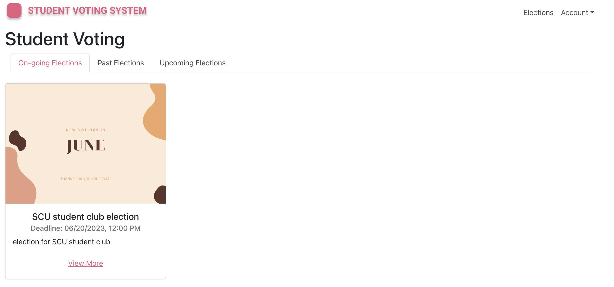
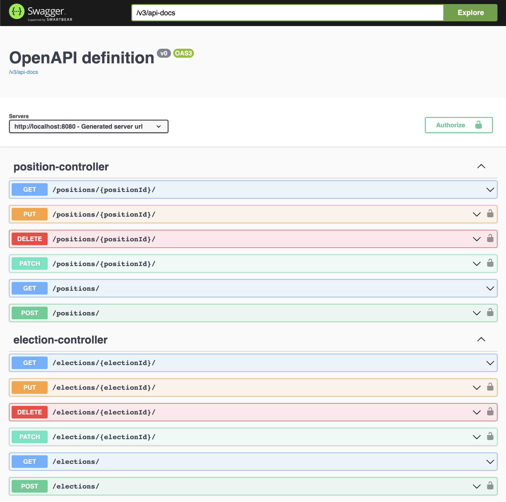

# Student Voting Portal
###### Santa Clara University | COEN 275 | Group 4
###### Author: Chun-Wei Chang | Yuhang Li | Yiyi Xiang

[GitHub Repository](https://github.com/blue86321/student-voting-portal)

## Introduction
The Student Voting Portal is a full-stack project utilizing Java SpringBoot for the backend and React for the frontend.
The portal caters to three distinct user types: normal user, admin, and superuser.

- **Normal user**
  - Register/Login with email
  - Browse all elections
  - Vote for elections (only their university)
  - Vote for multiple candidates for different positions
  - See election results, including votes cast, winner, and percentage of votes

- **Admin**
  - Create/Edit/Delete elections/positions/candidates
  - Add/Remove students in their university

- **Superuser**
  - All rights as admin, but not just limited to their university

## Run the Project

### Docker Run
```shell
# env is out-of-box, no need to change
cp .env.example .env
# Ctrl-C to stop
docker compose up
```

### Visit
- Frontend: http://localhost:3000
- Backend API docs: http://localhost:8080/swagger-ui.html

### Expected Results
#### Frontend


#### Backend


#### Default Data

##### User
| User Type   | University                           | Email             | Password     | Comment    |
| ----------- | ------------------------------------ | ----------------- | ------------ | ---------- |
| Superuser   | Santa Clara University (meaningless) | `super@gmail.com` | `super`      |            |
| Admin       | Santa Clara University               | `admin@scu.edu`   | `admin_scu`  |            |
| Normal User | Santa Clara University               | `user1@scu.edu`   | `user1_scu`  | voted user |
| Normal User | Santa Clara University               | `user2@scu.edu`   | `user2_scu`  | voted user |
| Normal User | Santa Clara University               | `user3@scu.edu`   | `user3_scu`  | voted user |
| Normal User | Santa Clara University               | `user4@scu.edu`   | `user4_scu`  | voted user |
| Normal User | Santa Clara University               | `user5@scu.edu`   | `user5_scu`  |            |
| Normal User | Santa Clara University               | `user6@scu.edu`   | `user6_scu`  | voted user |
| Normal User | Santa Clara University               | `user7@scu.edu`   | `user7_scu`  | voted user |
| Normal User | Santa Clara University               | `user8@scu.edu`   | `user8_scu`  | voted user |
| Normal User | Santa Clara University               | `user9@scu.edu`   | `user9_scu`  | voted user |
| Admin       | San Jose State University            | `admin@sjsu.edu`  | `admin_sjsu` |            |
| Normal User | San Jose State University            | `user1@sjsu.edu`  | `user1_sjsu` |            |
| Normal User | San Jose State University            | `user2@sjsu.edu`  | `user2_sjsu` |            |

### Destroy
```shell
# destroy docker container, volume, and relevant images
docker compose down -v --rmi all
```
